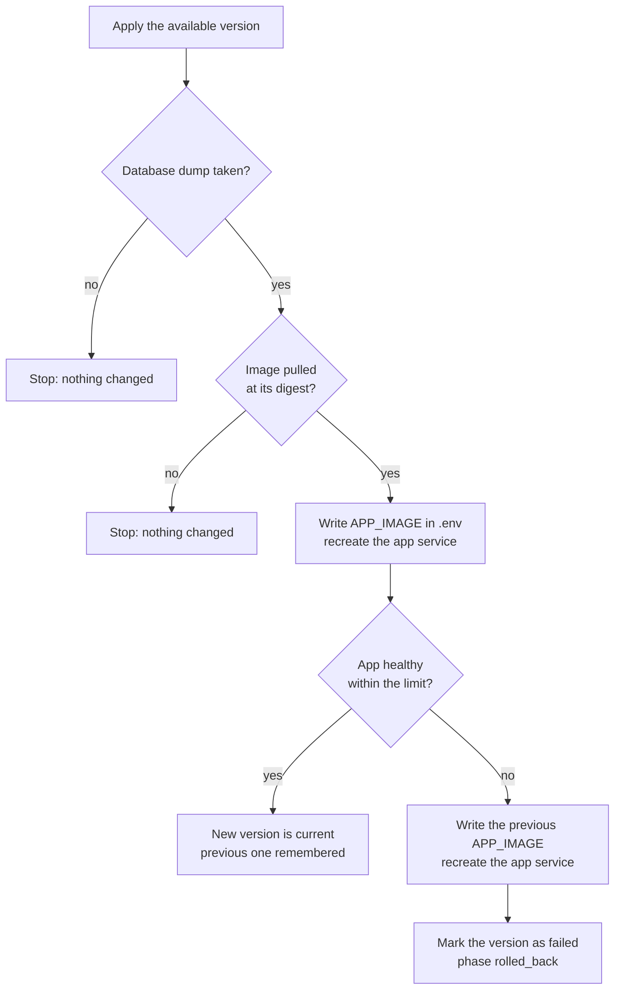

# Apply flow

What the supervisor does on `POST /apply`. Every branch has a test in `tests/apply_test.go`.

```mermaid
flowchart TD
    A[Apply the available version] --> B{Database dump taken?}
    B -->|no| X1[Stop: nothing changed]
    B -->|yes| C{Image pulled<br/>at its digest?}
    C -->|no| X2[Stop: nothing changed]
    C -->|yes| D[Write APP_IMAGE in .env<br/>recreate the app service]
    D --> E{App healthy<br/>within the limit?}
    E -->|yes| F[New version is current<br/>previous one remembered]
    E -->|no| G[Write the previous APP_IMAGE<br/>recreate the app service]
    G --> H[Mark the version as failed<br/>phase rolled_back]
```
