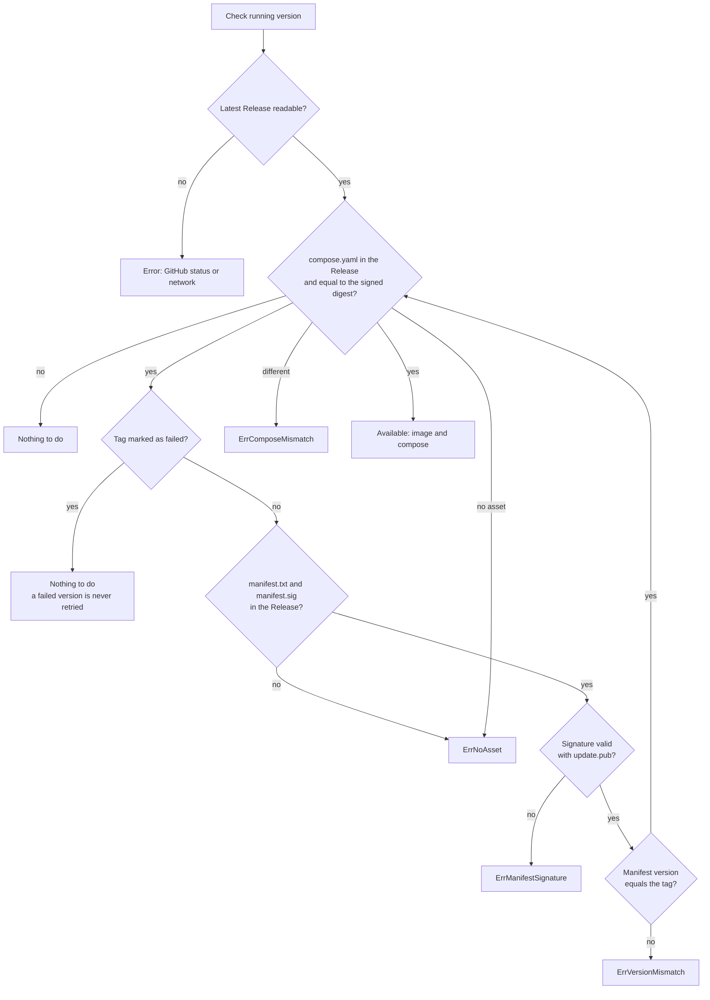

# Check flow

What `Checker.Check` does. Every branch has a test in `tests/check_test.go`.

```mermaid
flowchart TD
    A[Check running version] --> B{Latest Release readable?}
    B -->|no| X1[Error: GitHub status or network]
    B -->|yes| C{Release tag newer<br/>than running version?}
    C -->|no| N1[Nothing to do]
    C -->|yes| D{Tag marked as failed?}
    D -->|yes| N2[Nothing to do<br/>a failed version is never retried]
    D -->|no| E{manifest.txt and manifest.sig<br/>in the Release?}
    E -->|no| X2[ErrNoAsset]
    E -->|yes| F{Signature valid<br/>with update.pub?}
    F -->|no| X3[ErrManifestSignature]
    F -->|yes| G{Manifest version<br/>equals the tag?}
    G -->|no| X4[ErrVersionMismatch]
    G -->|yes| C{compose.yaml in the Release<br/>and equal to the signed digest?}
    C -->|no asset| X2
    C -->|different| X5[ErrComposeMismatch]
    C -->|yes| H[Available: image and compose]
```
