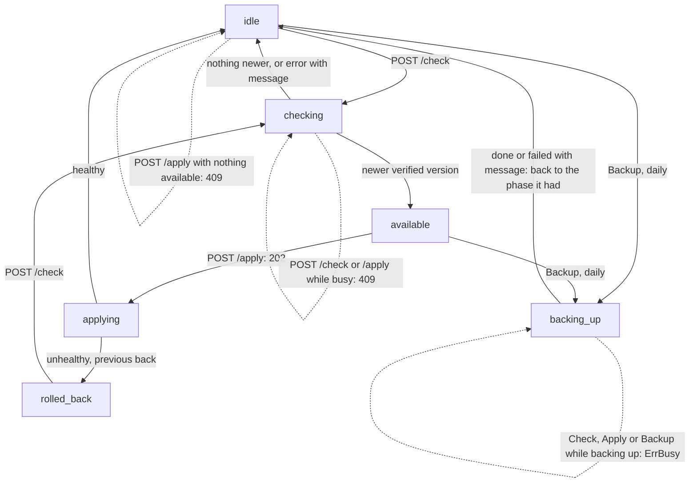

# Supervisor phases

What `GET /status` reports and how each request moves it. Every arrow has a test in `tests/supervisor_test.go`.

```mermaid
flowchart TD
    I[idle] -->|POST /check| C[checking]
    C -->|newer verified version| A[available]
    C -->|nothing newer, or error with message| I
    A -->|POST /apply: 202| P[applying]
    P -->|healthy| I
    P -->|unhealthy, previous back| R[rolled_back]
    R -->|POST /check| C
    C -.->|POST /check or /apply while busy: 409| C
    I -.->|POST /apply with nothing available: 409| I
    I -->|Backup, daily| B[backing_up]
    A -->|Backup, daily| B
    B -->|done or failed with message: back to the phase it had| I
    B -.->|Check, Apply or Backup while backing up: ErrBusy| B
```
