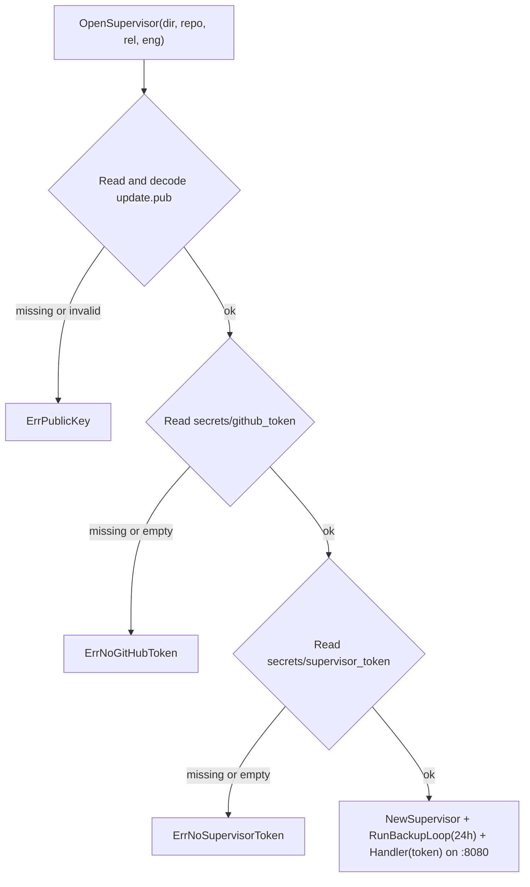

# Serve flow

What `selfupdate serve <owner/repo> <app>` runs inside the supervisor container. Tested in `tests/serve_test.go`.

```mermaid
flowchart TD
    A["OpenSupervisor(dir, repo, rel, eng)"] --> K{"Read and decode update.pub"}
    K -->|missing or invalid| EK["ErrPublicKey"]
    K -->|ok| G{"Read secrets/github_token"}
    G -->|missing or empty| EG["ErrNoGitHubToken"]
    G -->|ok| T{"Read secrets/supervisor_token"}
    T -->|missing or empty| ET["ErrNoSupervisorToken"]
    T -->|ok| S["NewSupervisor + RunBackupLoop(24h) + Handler(token) on :8080"]
```
